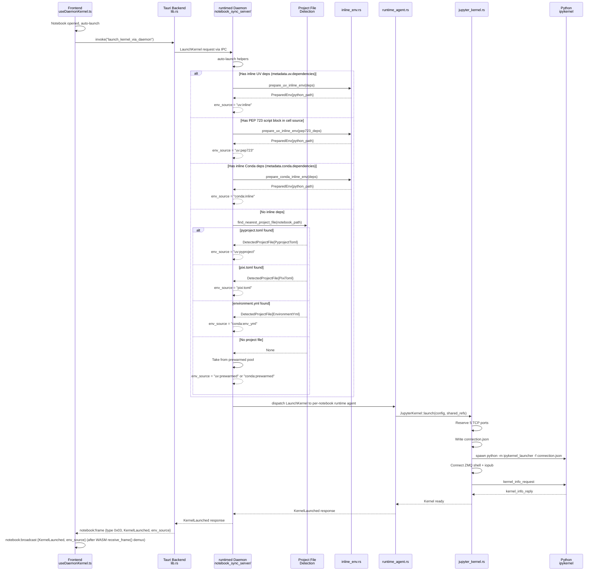

# Environment Management Architecture

This guide covers how Runt creates and manages Python and Deno environments for notebooks.

## Overview

When a user opens a notebook, Runt determines what kernel to launch based on a two-stage detection:

1. **Runtime Detection** — Is this a Python or Deno notebook?
2. **Environment Resolution** — For Python notebooks, what environment should we use?

This design allows Python and Deno notebooks to coexist in the same project directory.

```
Notebook opened
  │
  ├─ Check notebook kernelspec ────────── metadata.kernelspec.name
  │   │
  │   ├─ "deno" ───────────────────────── Launch Deno kernel (bootstrap via GitHub releases)
  │   │
  │   ├─ "python" / "python3" ─────────── Resolve Python environment:
  │   │   │
  │   │   ├─ Has inline deps? ─────────── Use UV or Conda with those deps
  │   │   ├─ Has PEP 723 script block? ── Use cached UV env from cell source (`uv:pep723`)
  │   │   │
  │   │   ├─ Closest project file?        (walk up from notebook, stop at .git / home)
  │   │   │   ├─ pyproject.toml ───────── Use `uv run` (project's .venv)
  │   │   │   ├─ pixi.toml ────────────── Convert to conda deps, use rattler
  │   │   │   └─ environment.yml ──────── Use conda with parsed deps
  │   │   │
  │   │   └─ Nothing found ────────────── Claim prewarmed env from pool
  │   │
  │   └─ Unknown/missing ──────────────── Use default_runtime setting
  │
  └─ New notebook ─────────────────────── Use default_runtime setting (Python or Deno)
```

## Kernel Launching Architecture

Kernel launching is handled by the `runtimed` daemon, which manages both Python and Deno kernels. The shared `kernel-launch` crate provides tool bootstrapping used by both the notebook app and daemon.

### Tool Bootstrapping

Tools (deno, uv, ruff, pixi) are automatically downloaded from GitHub releases if not found on PATH:

```rust
use kernel_launch::tools;

let deno = tools::get_deno_path().await?;  // PATH or ~/.cache/runt/tools/deno-{hash}/
let uv = tools::get_uv_path().await?;
let ruff = tools::get_ruff_path().await?;
```

This ensures the app works standalone without requiring users to install Python tooling.

## System Architecture Diagram

```mermaid
graph TB
    subgraph Frontend ["Frontend (TypeScript)"]
        UDK[useDaemonKernel.ts]
        UD[useDependencies.ts]
        UCD[useCondaDependencies.ts]
        DH[DependencyHeader.tsx]
        CDH[CondaDependencyHeader.tsx]
        DDH[DenoDependencyHeader.tsx]

        DH --> UD
        CDH --> UCD
    end

    subgraph TauriCmds ["Tauri Commands (lib.rs)"]
        LKD[launch_kernel_via_daemon]
        SKD[shutdown_kernel_via_daemon]
        GKINFO[get_daemon_kernel_info]
        VNT[verify_notebook_trust]
        DETP[detect_pyproject / detect_pixi_toml / detect_environment_yml]
    end

    subgraph Daemon ["runtimed Daemon (owns kernels)"]
        NSS[notebook_sync_server/metadata.rs<br/>auto-launch helpers]
        RA[runtime_agent.rs<br/>(spawned as subprocess)<br/>run_runtime_agent]
        JK[jupyter_kernel.rs<br/>JupyterKernel::launch<br/>(in runtime-agent process)]

        subgraph Detection ["Project File Detection"]
            PF[project_file.rs<br/>find_nearest_project_file]
            PP[pyproject.rs]
            PX[pixi.rs]
            EY[environment_yml.rs]
        end

        subgraph EnvCreation ["Environment Creation"]
            IE[inline_env.rs<br/>prepare_uv_inline_env<br/>prepare_conda_inline_env]
            UE[uv_env.rs]
            CE[conda_env.rs]
        end

        subgraph Pool ["Prewarmed Pool"]
            DM[daemon.rs<br/>Pool Management]
            UWL[UV Warming Loop]
            CWL[Conda Warming Loop]
        end

        subgraph Sync ["CRDT Sync"]
            SS[Settings Sync Server]
            NDS[Notebook Doc Sync]
        end

        NSS --> RA
        RA --> JK
        NSS --> PF
        PF --> PP
        PF --> PX
        PF --> EY
        NSS --> IE
        NSS --> DM
        DM --> UWL
        DM --> CWL
    end

    subgraph External ["External Tools"]
        UV[uv CLI]
        RAT[rattler<br/>Conda solver + installer]
        DENO[deno CLI]
        PY[Python / ipykernel]
    end

    %% Frontend → Tauri → Daemon
    UDK -->|"invoke(launch_kernel_via_daemon)"| LKD
    LKD -->|"IPC request"| NSS
    UD -->|"invoke(detect_pyproject)"| DETP
    UCD -->|"invoke(detect_pixi_toml)"| DETP

    %% Daemon → relay → frontend (typed notebook frames)
    NSS -.->|"notebook:frame → RuntimeStateDoc {kernel, env_source}"| UDK
    JK -.->|"notebook:frame → RuntimeStateDoc {lifecycle, queue, outputs}"| UDK
    VNT -.->|trust status| UD

    %% Environment creation → external tools
    IE -->|"uv venv + uv pip install"| UV
    IE -->|"rattler solve + install"| RAT
    UWL -->|"uv venv + warmup"| UV
    CWL -->|"rattler + warmup"| RAT
    JK -->|"deno jupyter --kernel"| DENO
    JK -->|"spawn python -m ipykernel_launcher"| PY

    %% Settings sync
    SS <-->|"Automerge sync"| UDK

    %% Styling
    classDef frontend fill:#e1f5fe,stroke:#0288d1
    classDef tauri fill:#fff3e0,stroke:#f57c00
    classDef daemon fill:#e8eaf6,stroke:#283593
    classDef external fill:#f5f5f5,stroke:#616161

    class UDK,UD,UCD,DH,CDH frontend
    class LKD,SKD,GKINFO,VNT,DETP tauri
    class NSS,RA,JK,PF,PP,PX,EY,IE,UE,CE,DM,UWL,CWL,SS,NDS daemon
    class UV,RAT,DENO,PY external
```

### Kernel Startup Sequence



### Daemon Pool Architecture

```mermaid
graph TB
    subgraph Daemon ["runtimed Daemon (singleton per user)"]
        direction TB
        LOCK[Singleton Lock<br/>~/.cache/runt/daemon.lock]
        ACCEPT[IPC Accept Loop<br/>~/.cache/runt/runtimed.sock]

        subgraph UVPool ["UV Pool"]
            UVA["available: VecDeque&lt;PoolEntry&gt;"]
            UVW["warming: usize"]
            UVT["target: 3"]
        end

        subgraph CondaPool ["Conda Pool"]
            CA["available: VecDeque&lt;PoolEntry&gt;"]
            CW["warming: usize"]
            CT["target: 3"]
        end

        UWL["UV Warming Loop (30s)
        1. uv venv {uuid}
        2. uv pip install ipykernel ipywidgets + defaults
        3. Python warmup (.pyc)
        4. Write .warmed marker"]

        CWL["Conda Warming Loop (30s)
        1. Setup rattler gateway
        2. Solve deps (resolvo)
        3. Install packages
        4. Python warmup (.pyc)
        5. Write .warmed marker"]

        SYNC["Settings Sync
        (multiplexed on runtimed.sock)
        Automerge CRDT"]

        UWL -->|add| UVPool
        CWL -->|add| CondaPool
    end

    subgraph Clients ["Notebook Windows"]
        W1[Window 1<br/>PoolClient]
        W2[Window 2<br/>PoolClient]
        W3[Window 3<br/>PoolClient]
    end

    W1 -->|"Take{Uv}"| ACCEPT
    W2 -->|"Take{Conda}"| ACCEPT
    W3 -->|"Return{env}"| ACCEPT
    ACCEPT -->|take| UVPool
    ACCEPT -->|take| CondaPool

    W1 <-.->|Automerge sync| SYNC
    W2 <-.->|Automerge sync| SYNC

    subgraph Disk ["~/.cache/runt/envs/"]
        E1["runtimed-uv-{uuid}/"]
        E2["runtimed-uv-{uuid}/"]
        E3["runtimed-conda-{uuid}/"]
    end

    UWL --> E1
    UWL --> E2
    CWL --> E3

    classDef pool fill:#e8eaf6,stroke:#283593
    classDef loop fill:#c5cae9,stroke:#1a237e
    classDef client fill:#e1f5fe,stroke:#0288d1
    classDef disk fill:#f5f5f5,stroke:#616161

    class UVPool,CondaPool pool
    class UWL,CWL loop
    class W1,W2,W3 client
    class E1,E2,E3 disk
```



### Reading the Diagrams

The diagrams show two main layers:

1. **Frontend** (blue) — React hooks that invoke Tauri commands, listen for typed notebook frames, and project daemon-authored runtime state from RuntimeStateDoc. `useDaemonKernel.ts` handles kernel actions and ephemeral runtime events. Output **rendering** is driven by RuntimeStateDoc manifests (`materialize-cells.ts`, `notebook-outputs.ts`, and `manifest-resolution.ts`), not output broadcasts.

2. **runtimed Daemon** (indigo) — A singleton background process that owns kernel processes and manages prewarmed UV and Conda environment pools. The daemon runs the detection priority chain: metadata inline deps first, then PEP 723 cell metadata (`uv:pep723`), then closest project file, then prewarmed pool. Communicates via length-prefixed JSON over Unix domain sockets (or Windows named pipes). Also runs an Automerge CRDT sync server for cross-window settings and notebook state.

3. **External Tools** (grey) — `uv` for pip-compatible package management, `rattler` for conda solving/installing, and `deno` for TypeScript notebooks.

The Tauri backend (orange) acts as a thin relay layer, forwarding kernel requests to the daemon via IPC.

## Detection Priority Chain

Kernel launching uses a two-stage detection: **runtime detection** (Python vs Deno) followed by **environment resolution** (for Python only).

### Stage 1: Runtime Detection

The daemon reads the notebook's kernelspec to determine if it's a Python or Deno notebook:

| Priority | Source | Check | Result |
|----------|--------|-------|--------|
| 1 | Notebook metadata | `metadata.kernelspec.name == "deno"` | Launch Deno kernel |
| 2 | Notebook metadata | `metadata.kernelspec.name` contains "python" | Resolve Python environment |
| 3 | Notebook metadata | `metadata.kernelspec.language == "typescript"` | Launch Deno kernel |
| 4 | Notebook metadata | `metadata.language_info.name == "typescript"` | Launch Deno kernel |
| 5 | User setting | `default_runtime` preference | Python or Deno |

**Key invariant**: The notebook's encoded kernelspec takes priority over project files. A Deno notebook in a directory with `pyproject.toml` will launch a Deno kernel, not a Python kernel.

### Stage 2: Python Environment Resolution

For Python notebooks, the daemon resolves which environment to use:

| Priority | Source | Backend | Environment Type |
|----------|--------|---------|-----------------|
| 1 | Inline notebook metadata | uv or conda deps from `metadata.uv` / `metadata.conda` | Cached by dep hash |
| 2 | Closest project file | Single walk-up via `project_file::find_nearest_project_file` | Depends on file type |
| 3 | User preference | Prewarmed UV or Conda env from pool | Shared pool env |

For step 2, the walk-up checks for `pyproject.toml`, `pixi.toml`, and `environment.yml`/`environment.yaml` at **each directory level**, starting from the notebook's location. The first (closest) match wins. When multiple project files exist in the same directory, the tiebreaker order is: pyproject.toml > pixi.toml > environment.yml > environment.yaml.

The walk-up stops at `.git` boundaries and the user's home directory, preventing cross-repository project file pollution.

| Project file | Backend | Environment Type | Pool |
|-------------|---------|-----------------|------|
| `pyproject.toml` | `uv run --with ipykernel` in project dir | Project `.venv/` | UV |
| `pixi.toml` | Convert pixi deps to `CondaDependencies`, use rattler | Cached by dep hash | Conda |
| `environment.yml` | Parse deps, use rattler | Cached by dep hash | Conda |

### Deno Kernel Launching

Deno kernels do not use environment pools. The daemon:

1. Gets the deno binary path via `kernel_launch::tools::get_deno_path()` (checks PATH first, then bootstraps from conda-forge)
2. Launches: `deno jupyter --kernel --conn <connection_file>`

**Note**: Deno notebooks do not look for project files. The `deno.json`/`deno.jsonc` detection is only used for Deno-specific configuration, not for determining kernel type.

### New Notebooks

When a user creates a new notebook (File → New), the kernel type is determined by:

- **New → Python Notebook**: Creates notebook with `kernelspec.name: "python3"`, uses `default_python_env` setting (UV or Conda) for the prewarmed pool
- **New → Deno Notebook**: Creates notebook with `kernelspec.name: "deno"`, launches Deno kernel

## Content-Addressed Caching

Every environment lives at `{cache}/{hash}/`. The hash uses one rule across UV and Conda:

```
hash = sha256(sorted_deps + resolver_fields + env_id)[..16]
```

Resolver fields differ per runtime (UV: `requires-python`, `prerelease`; Conda: `sorted_channels`, `python`), but `env_id` is **always** included. Every notebook's env is isolated per notebook — there is no cross-notebook env sharing at the disk level, on purpose. Hot-sync on notebook A would silently mutate a shared env under notebook B, which is a correctness trap (see issue #1954 § Cross-notebook sharing default).

| Runtime | Source of truth | Cache dir |
|---------|-----------------|-----------|
| UV | `kernel_env::uv::compute_unified_env_hash(deps, env_id)` | `~/.cache/runt/envs/{hash}/` |
| Conda | `kernel_env::conda::compute_unified_env_hash(deps, env_id)` | `~/.cache/runt/conda-envs/{hash}/` |

Cache hit check: verify that `{hash}/bin/python` (Unix) or `{hash}/Scripts/python.exe` (Windows) exists — same as before.

### Base-package constants

The pool warmer and the capture step both strip a shared base set so captured metadata records only user intent:

| Constant | Value |
|----------|-------|
| `kernel_env::uv::UV_BASE_PACKAGES` | `[ipykernel, ipywidgets, anywidget, nbformat, uv, dx]` |
| `kernel_env::conda::CONDA_BASE_PACKAGES` | `[ipykernel, ipywidgets, anywidget, nbformat]` |
| `kernel_env::strip_base(installed, base)` | Filter the base set out of an install list |

Adding to the base set never retroactively rewrites captured notebooks — each notebook keeps whatever set was captured the day it was first claimed.

## Prewarming and the Daemon Pool

To make notebook startup instant, the daemon maintains a pool of pre-created environments installed with the base set plus the user's current `default_packages` setting. Entries in the pool are named `runtimed-{uv,conda}-{uuid}` and are content-free — they can be claimed by any notebook.

**Daemon pool** (`crates/runtimed/src/daemon.rs`):
- The `runtimed` daemon runs as a background process
- Manages UV and Conda environment pools across notebook windows
- Default pool size: 3 environments per type
- Max age: 2 days (172800 seconds)
- Warming loops replenish environments as they're consumed

### First-launch capture

A notebook is "captured" on first launch out of the pool. The daemon:

1. Takes an entry from the pool (`runtimed-uv-{uuid}` / `runtimed-conda-{uuid}`).
2. Computes `user_defaults = strip_base(prewarmed_packages, BASE_PACKAGES)`.
3. Renames the env dir from the pool name to `{cache}/{compute_unified_env_hash(user_defaults, env_id)}/`.
4. Writes `user_defaults` into `metadata.runt.{uv,conda}.dependencies` and ensures `metadata.runt.env_id` is set via `doc.transact_at_heads_recovering(...)` per the CRDT-mutation rule.

After this, the notebook is indistinguishable from an inline-deps notebook — the pool is a bootstrap optimisation, not a runtime dependency.

`capture_env_into_metadata` in `notebook_sync_server/metadata.rs` is idempotent and write-once: it only populates empty sections. User-edited deps are not clobbered.

### Reopen: cache-hit via `unified_env_on_disk`

On subsequent launches the daemon reads `metadata.runt.{uv,conda}` + `metadata.runt.env_id`, recomputes `compute_unified_env_hash`, and checks `unified_env_on_disk`. Cache hit → `prepare_environment_unified` returns instantly, no pool take. Cache miss → falls through to the inline-deps path and rebuilds (happens after a daemon restart if the env was GC'd, or for notebooks shared from another machine).

The "captured" predicate is **disk-only**: `unified_env_on_disk(captured).is_some()`. Deps-present-but-disk-absent is intentionally not treated as captured because it's indistinguishable from a fresh notebook whose user added inline deps before first launch (see PR #1962).

### Preserve captured envs on room eviction

Room eviction fires 30 s after the last peer disconnects, plus any time the daemon restarts. By default that tears down the env dir. Captured envs bound to a **saved** `.ipynb` survive eviction so the next reopen cache-hits; untitled notebooks, pool envs, and saved notebooks whose env is still a pool dir get deleted as before. The predicate lives in `should_preserve_env_on_eviction`.

Without this, PR #1960's reopen path only worked inside a single daemon session — any restart blew away the cache. See PR #1963 and issue #1954 § "Correction to the design."

### Hot-sync coherence at eviction

When a user runs `sync_environment` mid-session (adds packages to a running kernel), the new packages land in the in-memory `LaunchedEnvConfig` but not in the notebook metadata or the on-disk hash. If we stopped there, the saved `.ipynb` would be stale and the next reopen would find an env at the wrong hash.

At eviction, after the runtime agent is shut down and before env cleanup:

1. `flush_launched_deps_to_metadata` writes the kernel's post-sync dep list (via `effective_user_deps_from_launched`, which applies `strip_base`) into `metadata.runt.{uv,conda}.dependencies` using `doc.transact_at_heads_recovering(...)`.
2. `save_notebook_to_disk` persists the updated metadata to the `.ipynb` synchronously.
3. `rename_env_dir_to_unified_hash` moves the on-disk env from the pre-flush hash to the post-flush hash so the next reopen's `unified_env_on_disk` lookup hits. The rename is gated on save success and is explicitly scoped to the launched runtime (UV xor Conda), and skipped if the target path already exists.

Kernel is guaranteed dead at this point, so renaming is safe (no process holds the old `VIRTUAL_ENV`). See PR #1964.

## Project File Discovery

The unified project file detection lives in `project_file.rs` and is used by the daemon's auto-launch helpers for kernel launch decisions:

| Module | Purpose |
|--------|---------|
| `project_file.rs` | `find_nearest_project_file()` — single walk-up checking all project file types at each level, closest wins |

Individual project file modules still exist for parsing, Tauri detection commands, and the dependency management UI:

| Module | File | Function |
|--------|------|----------|
| `pyproject.rs` | `pyproject.toml` | `find_pyproject()`, parsing, Tauri commands |
| `pixi.rs` | `pixi.toml` | `find_pixi_toml()`, parsing, Tauri commands |
| `environment_yml.rs` | `environment.yml` / `environment.yaml` | `find_environment_yml()`, parsing, Tauri commands |
| `deno_env.rs` | `deno.json` / `deno.jsonc` | `find_deno_config()` |

All walk-up functions (both unified and individual) stop at `.git` boundaries and the user's home directory.

Each per-format module provides:
- A parse function to extract dependencies
- Tauri commands for frontend detection (`detect_*`)
- Dependency listing (`get_*_dependencies`) for pyproject.toml and environment.yml (pixi does not have a `get_pixi_dependencies` command — only `detect_pixi_toml` and `import_pixi_dependencies`)
- Import commands (`import_*_dependencies`) for pyproject.toml and pixi.toml (environment.yml does not have an import command)

## Notebook Metadata Schema

Dependencies and environment config are stored in notebook JSON metadata:

```json
{
  "metadata": {
    "kernelspec": {
      "name": "python3",
      "display_name": "Python 3",
      "language": "python"
    },
    "runt": {
      "schema_version": "1",
      "env_id": "uuid",
      "uv": {
        "dependencies": ["pandas", "numpy"],
        "requires-python": ">=3.10"
      },
      "conda": {
        "dependencies": ["numpy", "scipy"],
        "channels": ["conda-forge"],
        "python": "3.12"
      },
      "deno": {
        "permissions": ["--allow-net", "--allow-read"],
        "config": "deno.json"
      }
    }
  }
}
```

Note: The runtime type (Python vs Deno) is determined by `kernelspec.name`, not by a field in `runt`. The kernelspec is the standard Jupyter metadata field.

`runt.env_id` is the canonical per-notebook identifier used for environment isolation.

## Trust System

Dependencies are signed with HMAC-SHA256 to prevent untrusted code execution on notebook open.

- **Key**: 32 random bytes stored at `~/Library/Application Support/runt/trust-key` (macOS) or `~/.config/runt/trust-key` (Linux), generated on first use
- **Signed content**: Canonical JSON of `metadata.runt.uv` + `metadata.runt.conda` (with fallback to legacy `metadata.uv` + `metadata.conda`; not cell contents or outputs)
- **Signature format**: `"hmac-sha256:{hex_digest}"` stored in notebook metadata
- **Machine-specific**: The key is per-machine, so every shared notebook is untrusted on the recipient's machine
- **Verification**: `trust.rs:verify_signature()` returns `bool`. The higher-level `verify_notebook_trust()` returns `TrustInfo` (containing a `TrustStatus`: Trusted, Untrusted, SignatureInvalid, or NoDependencies)

Changes to the dependency metadata structure require updating `crates/notebook-doc/src/metadata.rs` and the signing logic in `crates/runt-trust/src/lib.rs`.

## Frontend Architecture

Three UI components manage dependencies for different runtimes:

| Component | Hook | Manages |
|-----------|------|---------|
| `DependencyHeader.tsx` | `useDependencies.ts` | UV deps, pyproject.toml detection |
| `CondaDependencyHeader.tsx` | `useCondaDependencies.ts` | Conda deps, environment.yml and pixi.toml detection |
| `DenoDependencyHeader.tsx` | `useDenoConfig.ts` | Deno configuration and deno.json detection |

The kernel lifecycle is managed by `useDaemonKernel.ts`, which:
- Derives kernel status, execution queue, and env sync state from RuntimeStateDoc
- Listens for ephemeral runtime event callbacks from typed notebook frames
- Provides `launchKernel()`, `executeCell()`, `syncEnvironment()` methods
- Leaves project-file detection and auto-launch decisions to the daemon

## Testing

**Unit tests**: Each project file module has thorough tests. `environment_yml.rs` is the best exemplar — it covers discovery logic, parsing edge cases, and conversion to `CondaDependencies`.

**Test fixtures**: `crates/notebook/fixtures/audit-test/` contains numbered test notebooks:
- `1-vanilla.ipynb` — no dependencies
- `2-uv-inline.ipynb` — inline UV dependencies
- `3-conda-inline.ipynb` — inline conda dependencies
- `4-both-deps.ipynb` — both UV and conda
- `pyproject-project/5-pyproject.ipynb` — notebook next to pyproject.toml
- `pixi-project/6-pixi.ipynb` — notebook next to pixi.toml
- `conda-env-project/7-environment-yml.ipynb` — notebook next to environment.yaml

**E2E tests**: `e2e/specs/` contains WebDriverIO tests that build the app and verify kernel startup with each environment type. See `contributing/e2e.md` for the E2E testing guide.

## Key Files

### Shared Kernel Launch Crate

| File | Role |
|------|------|
| `crates/kernel-launch/src/lib.rs` | Public API for kernel launching |
| `crates/kernel-launch/src/tools.rs` | Tool bootstrapping (deno, uv, ruff, pixi) via GitHub releases |

### Daemon (Kernel Management)

| File | Role |
|------|------|
| `crates/runtimed/src/daemon.rs` | Background daemon pool management, passes settings to handlers |
| `crates/runtimed/src/notebook_sync_server/metadata.rs` | runtime detection and environment resolution helpers used by auto-launch |
| `crates/runtimed/src/requests/launch_kernel.rs` | manual launch request handling |
| `crates/runtimed/src/runtime_agent.rs` | Spawned as a subprocess by `RuntimeAgentHandle::spawn()`. `run_runtime_agent()` is the per-notebook event loop owning sockets, `QueueCommand` channels, and RuntimeStateDoc writes; `handle_runtime_agent_request()` dispatches each `LaunchKernel`/`RestartKernel`/etc. RPC |
| `crates/runtimed/src/jupyter_kernel.rs` | `JupyterKernel::launch()` — spawns Python or Deno kernel processes, wires ZMQ sockets |
| `crates/runtimed/src/output_prep.rs` | Output-prep helpers — `QueueCommand`, `KernelStatus`, `QueuedCell`, iopub → nbformat conversion + display-update helpers, widget-buffer offload. Imported by `runtime_agent.rs`, `jupyter_kernel.rs`, and `kernel_state.rs` |
| `crates/runtimed/src/project_file.rs` | Unified closest-wins project file detection (pyproject.toml, pixi.toml, environment.yml/yaml) |

### Notebook Crate (Tauri Commands)

| File | Role |
|------|------|
| `crates/notebook/src/lib.rs` | Tauri commands (save, format, kernel, env), sync pipe setup, `launch_kernel_via_daemon` |
| `crates/notebook-doc/src/metadata.rs` | Notebook dependency metadata schema and accessors |
| `crates/runtimed/src/project_file.rs` | Unified closest-wins project file detection |
| `crates/notebook/src/settings.rs` | User preferences (default runtime, env type) |
| `crates/runt-trust/src/lib.rs` | HMAC trust verification |

### Frontend

| File | Role |
|------|------|
| `apps/notebook/src/hooks/useDaemonKernel.ts` | Daemon-owned kernel execution, status broadcasts, environment sync |
| `apps/notebook/src/hooks/useDependencies.ts` | Frontend UV dep management |
| `apps/notebook/src/hooks/useCondaDependencies.ts` | Frontend conda dep management |
| `apps/notebook/src/components/DependencyHeader.tsx` | UV dependency UI panel |
| `apps/notebook/src/components/CondaDependencyHeader.tsx` | Conda dependency UI panel |
| `apps/notebook/src/components/DenoDependencyHeader.tsx` | Deno configuration UI panel |
