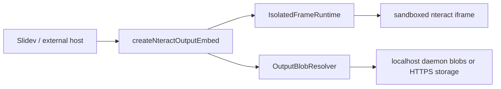

# Embeddable nteract outputs

Slidev using the same isolated output runtime as the notebook app.

  decks/talk

---

## What this deck proves

- A non-React host can render notebook outputs through `createNteractOutputEmbed`
- The iframe sandbox, renderer bundle, plugin injection, host context, resize, and teardown contract are shared
- Blob-backed manifests use a resolver boundary instead of direct daemon coupling

---
layout: center
---

## Dev relay status

<RelayStatus />

The relay is optional for these fixtures. It becomes useful when a slide needs live daemon blobs or a later notebook/session layer.

---

## Stream plus markdown

<NteractOutput
  label="stream + text/markdown"
  fixture="stream-markdown"
/>

This exercises mixed output batches and the markdown renderer plugin.

---

## DataFrame output

<NteractOutput
  label="execute_result · pandas-style HTML"
  fixture="dataframe"
/>

This follows the same rendered-output path used for DataFrames in notebook cells.

---

## Blob-backed manifest

<NteractOutput
  label="display_data · manifest through fake blob resolver"
  fixture="blob-html"
/>

The resolver here is local and deterministic. A daemon blob server or signed HTTPS storage can implement the same interface.

---

## Architecture boundary

Notebook execution stays out of this layer. The input is already-resolved output payloads, Jupyter outputs, or output manifests.
