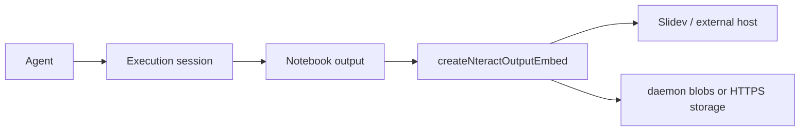

# Give Your Agents REPLs

Rich notebook outputs, embedded in a deck, without leaving the talk.

  decks/talk

---

## The pitch

- Agents need to inspect data, not just emit prose
- REPLs give agents a tight loop: run code, observe rich outputs, decide the next step
- nteract outputs should embed cleanly in other hosts, starting with Slidev

---
layout: center
---

## Dev daemon relay status

<RelayStatus />

The table slide uses the real Sift renderer path. Slidev serves the MathNet Arrow chunk; Sift WASM comes from the worktree daemon blob server.

---

## A REPL is an observation loop

<NteractOutput
  label="agent REPL · stream + markdown observation"
  fixture="agent-repl"
/>

The stream and markdown output are not decoration. They are the agent's working memory made inspectable.

---

## Same output, two consumers

<HumanAgentTableComparison />

One output carries a rich table for people and `text/llm+plain` for the agent loop.

---

## Outputs need a durable content boundary

<NteractOutput
  label="MathNet problem card · manifest through blob resolver"
  fixture="mathnet-problem-card"
/>

This fixture uses a local fake blob resolver. The same contract can point at daemon blobs today and signed HTTPS storage later.

---

## Why this matters for embedding

This PR is the output surface only. Live sessions, execution targets, and notebook lookup can layer on top without changing how rendered outputs embed.
