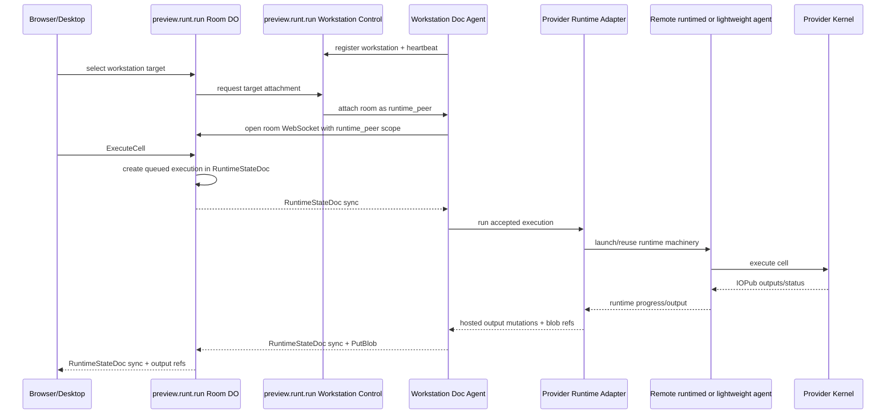

# Remote Workstation Doc Agents

**Status:** Draft, 2026-06-04.

## Context

We need a provider-neutral path for users to run notebook compute on an nteract
workstation while using the hosted room surface at `preview.runt.run`.

In this design, **workstation** is the nteract product noun. JupyterHub can
provide an nteract workstation. Outerbounds can provide nteract workstations.
Future provider adapters can do the same without changing hosted room
authority.

PR [#3359](https://github.com/nteract/nteract/pull/3359) proves a useful
primitive for Desktop: a local daemon can launch a runtime agent through an SSH
wrapper by passing `--runtime-agent-exe` or `RUNTIMED_RUNTIME_AGENT_EXE`. In
that design the local daemon remains the notebook room authority. SSH is only
the transport that moves execution close to a remote kernel.

PR [#3380](https://github.com/nteract/nteract/pull/3380) proves a second useful
primitive on the product surface: Desktop and Hosted can feed host-owned content
sections into a shared notebook rail. The prototype data is still
fixture-backed, but the contract is the right shape for a future hosted catalog
that can include notebooks, shared rooms, local files, and workstation content
without making the shared rail own those data sources.

The hosted workstation path inverts the SSH prototype's direction. Instead of a
local daemon SSHing into compute, a remote process dials home to
`preview.runt.run`, registers itself as an available workstation/doc agent, and
later attaches to selected notebook rooms as a scoped `runtime_peer`.

Outerbounds publicly positions Workstations as always-on, personal cloud
workstations that support VS Code and Jupyter notebooks inside the customer's
cloud. JupyterHub already has a well-understood service/single-user-server model
for launching per-user compute. Both are good providers for long-lived
interactive workstation targets.

Neighbors:

- `deployment-topology.md` defines hosted rooms, room hosts, and runtime peers.
- `hosted-room-authorization.md` defines the `runtime_peer` ACL scope.
- `hosted-credential-transport.md` defines API-key and bearer-token transport.
- `runtime-peer-and-blob-authority-audit.md` keeps `runtime_peer` distinct from
  local `RuntimeAgent`.
- `typed-frame-v4-wire-protocol.md` defines the room WebSocket frame protocol.
- PR #3380, `quod/content-explorer-prototype`, defines the shared content rail
  host-provided-section contract that can later show workstation catalogs.

## Vocabulary

- **nteract workstation**: a provider-backed compute/workspace target that can
  be shown to users, selected by a room, and attached to a hosted notebook.
- **compute source**: anything a room can select for execution. Local Desktop,
  registered workstations, and SSH/direct-access targets can all become compute
  sources, but they do not share the same security or protocol boundary.
- **provider**: the system that supplies the workstation, such as JupyterHub,
  Outerbounds, local Desktop, or a future managed runtime service.
- **doc agent**: the remote registration/control actor for a workstation. It
  dials home, advertises capabilities, receives attach commands, and may expose
  safe catalog metadata.
- **runtime peer**: a room-scoped WebSocket connection with `runtime_peer`
  authority. It can write runtime lifecycle/progress/output state for accepted
  work, but cannot edit `NotebookDoc` or create execution intent.
- **runtime adapter**: provider-specific code that translates accepted room
  execution into local kernel/runtime work.

The doc agent and runtime peer are intentionally separate. A workstation can be
online as a doc agent before it is attached to any room as a runtime peer.

## Compute source taxonomy

The UI should make three related compute families visible without flattening
their authority models:

1. **Local Desktop.** Desktop can offer the user's local machine as compute,
   much like a local Codex/Claude-style agent surface. This should be
   owner-only and should not grant other room participants access to the user's
   local daemon, filesystem, Python, or shell.
2. **Registered workstations.** Outerbounds Workstations, JupyterHub-backed
   servers, and future managed targets register with the hosted API as
   workstation/doc agents. They can be room-mediated through attachment tickets
   and `runtime_peer` scope.
3. **SSH/direct access.** The SSH prototype is a direct key-based cross-compute
   path. It is workstation-like in the UI because it selects a remote compute
   target, but its trust boundary is SSH credentials plus Desktop ownership, not
   hosted API registration.

The selected compute target is room state. The attached interpreter, kernelspec,
package set, and readiness are environment state for the current notebook after
the target is selected.

## Decision 1: Workstations dial home as doc agents

Add a workstation connector process that runs inside the provider environment
and opens an outbound authenticated connection to `preview.runt.run`.

The install flow for an Outerbounds-hosted workstation might look like:

```bash
curl -fsSL https://preview.runt.run/install/outerbounds | sh
runt workstation login --api-key-stdin
runt workstation service install --provider outerbounds
```

A JupyterHub deployment might install the same connector as a Hub service,
single-user-server sidecar, or kernelspec-adjacent process:

```bash
runt workstation service install --provider jupyterhub
```

The exact command names can change, but the properties should not:

- The API key or provider credential is supplied once and stored in a
  user-private service credential, never in argv for the long-running process.
- The workstation process makes outbound HTTPS/WebSocket connections only.
- The hosted service records workstation metadata: owner principal, provider,
  provider instance, display name, hostname or workspace id, version,
  capabilities, last seen time, and health.
- Registration proves the user's identity and workstation ownership. It does
  not grant room runtime authority by itself.

The doc-agent control channel is not the notebook room sync channel. It is a
workstation registration and command channel:

- register/update workstation metadata;
- heartbeat and report health;
- advertise runtime, workspace, catalog, and environment capabilities;
- receive "attach this workstation to room X" commands;
- report attachment status and provider diagnostics.

Room execution still flows through a room-scoped `runtime_peer` connection.

## Decision 2: Providers supply workstations through adapters

Outerbounds and JupyterHub should be modeled as providers of the same nteract
workstation abstraction.

Outerbounds-specific adapter responsibilities:

- install inside an Outerbounds Workstation;
- use the workstation's current filesystem and current Python environment by
  default;
- discover stable workspace identity and project metadata once the VS Code
  extension/source clarifies Outerbounds connection semantics;
- avoid assuming that nteract can manage or recreate the provider environment.

JupyterHub-specific adapter responsibilities:

- authenticate and authorize through JupyterHub service/single-user-server
  mechanisms;
- map Hub user/server identity into nteract principals and workstation ids;
- expose available kernelspecs and workspace roots when the deployment permits;
- avoid making JupyterHub the room document authority.

Provider adapters may differ substantially below the doc-agent control plane.
The hosted room should still see the same product shape: online workstations
with capabilities that can be selected, attached, detached, and rendered in
shell UI.

## Decision 3: Room attachment uses `runtime_peer`, not `RuntimeAgent`

When a user chooses a workstation for a hosted notebook room, the workstation's
doc agent opens a separate WebSocket to:

```text
wss://preview.runt.run/n/<notebook-id>/sync
```

It requests `scope=runtime_peer` using either a normal validated bearer
credential or a short-lived room attachment ticket minted by the hosted service.
The Durable Object authorizes the connection against the room ACL and provider
bounds before accepting it.

This preserves the existing hosted authority model:

- Browser, desktop, or agent connections create notebook edits and execution
  intent.
- The Durable Object is the document and execution-intent authority.
- The workstation runtime peer is compute authority only for accepted
  executions.
- The local `RuntimeAgent` protocol remains inside the daemon that owns the
  kernel; it is not exposed as an internet-facing API.

## Decision 4: Execution intent stays coordinator-owned

The room host must create execution records from editor/owner requests before a
runtime peer can act on them.

For `ExecuteCell`:

1. An editor/owner sends `NotebookRequest::ExecuteCell` to the room host.
2. The room host verifies the request, required heads, and active workstation.
3. The room host writes a queued execution entry into `RuntimeStateDoc` with the
   cell id, source, sequence number, and coordinator-owned provenance.
4. The runtime peer observes the queued entry through `RuntimeStateDoc` sync.
5. The runtime peer runs the cell and updates only allowed runtime fields:
   kernel lifecycle, queue progress, status transitions, outputs, and blob refs.

The existing runtime-doc policy already points in this direction: runtime peers
may update accepted executions and queue projection, but they may not create
execution records, rewrite room-host-owned fields, or edit `NotebookDoc`.

Kernel lifecycle requests should follow the same split. The room host accepts
`LaunchKernel`, `RestartKernel`, `InterruptExecution`, and `ShutdownKernel`
requests from allowed user roles, then dispatches the corresponding runtime work
to the active workstation runtime peer.

## Decision 5: Current Python is a first-class environment policy

Outerbounds needs a lighter-weight runtime agent path because the important
environment is often the workstation's current Python, not a daemon-managed
environment that nteract builds from notebook metadata.

The workstation capability payload should include an explicit environment
policy:

```text
environment_policy = current_python | kernelspec | managed_project | unknown
```

For `current_python`:

- the adapter executes with the Python interpreter visible to the installed
  connector or selected provider workspace;
- package-management controls stay disabled unless the provider adapter
  explicitly advertises safe package mutation;
- the UI labels the target as current Python on the workstation, not as a
  reproducible managed environment;
- dependency trust remains a notebook/document concern, but environment repair
  is provider-owned.

This gives Outerbounds a practical first implementation without forcing it into
the Desktop daemon's environment-management model. JupyterHub deployments can
advertise `kernelspec` when the Hub's kernel selection is the right surface.

## Decision 6: The remote daemon is an adapter boundary

The connector should reuse daemon/runtime-agent implementation near the kernel
where useful, but the cross-machine boundary should be higher level than the
local `RuntimeAgent` socket.

Recommended shape:



The adapter can start as a thin wrapper around a colocated daemon or a lighter
current-Python runtime process:

- Use provider-local machinery to manage kernels, interrupts, and output
  preparation.
- Translate hosted room execution entries into provider-local runtime work.
- Translate local runtime progress/output back into hosted `RuntimeStateDoc`
  mutations and hosted blob uploads.

The adapter may eventually become a native mode inside `runtimed`, but the v1
contract should be clear before folding it into the daemon.

## Decision 7: Target selection is explicit room state

Hosted rooms need an explicit active workstation target, distinct from access
control.

Minimum target state:

```text
workstation_id
workstation_provider = "outerbounds" | "jupyterhub" | ...
workstation_display_name
workstation_principal
workstation_environment_policy
workstation_status = disconnected | connecting | ready | busy | error
workstation_capabilities
```

The UI should treat workstation availability as runtime capability, not as
editor authorization. A user can edit a hosted notebook without a connected
workstation target. Run/restart/package controls appear only when the room has
an active, ready target and the user's role permits execution requests.

Open detail: this state can live in a small room-host-owned portion of
`RuntimeStateDoc` or as Durable Object side state mirrored through
`SessionControl`. If it affects execution behavior or late-join rendering, it
should become durable room-host-owned runtime state rather than only an
ephemeral control message.

## Decision 8: Content discovery and runtime attachment stay separate

PR #3380's shared Content rail is relevant to workstations, but it should not
become the runtime authority surface.

Use the rail for host-owned discovery:

- available hosted notebooks;
- notebooks shared with the user;
- the current room;
- future workstation content, such as remote project folders, notebook files,
  environment files, datasets, or recent workstation artifacts.

Use workstation target state for attachment and execution:

- selected workstation target;
- attach/detach status;
- kernel/runtime readiness;
- execution and package-management capability.

This keeps the shared rail contract clean. The rail receives host-provided
sections and `onOpenContentItem` callbacks; it does not decide what a user may
run, which workstation is attached, or whether a room can create execution
intent. Hosted and Desktop shells can render a workstation's catalog in Content
while the toolbar/header continues to expose the active workstation target and
its state.

The practical implication for the first implementation slice: the workstation
registry should be shaped so it can later back both APIs:

- workstation-target APIs for selecting and attaching compute;
- content-catalog APIs for showing workstation/project artifacts in the shared
  rail.

## UI prototype direction

The first UI prototype should be a shell experience, not a full runtime
transport implementation.

Prototype these states in Elements:

- no workstation selected: editing is possible, execution controls are hidden;
- workstation online: the target is visible in the cloud shell but not attached;
- attaching: the control plane is connecting the doc agent to the room;
- ready: the header names the active workstation and the notebook toolbar shows
  kernel controls;
- current Python: the active target is explicitly labeled as current Python on
  the workstation, with package mutation disabled;
- disconnected: the active target remains selected but execution controls are
  disabled and queued work fails after a timeout.

The cloud shell should expose the active workstation in host-owned chrome and
continue to use shared notebook components for notebook commands. Existing
actor projection can show runtime authorship once the workstation attaches as a
`runtime_peer`.

## API sketch

Control plane:

```text
POST /api/workstations/register
GET  /api/workstations
GET  /api/workstations/:id
WS   /api/workstations/:id/control
```

Room APIs:

```text
GET  /api/n/:id/workstation-targets
POST /api/n/:id/workstation-target
POST /api/n/:id/workstation-target/attach
POST /api/n/:id/workstation-target/detach
```

The v1 storage can use D1 tables roughly shaped as:

```sql
workstations(
  id TEXT PRIMARY KEY,
  owner_principal TEXT NOT NULL,
  provider TEXT NOT NULL,
  provider_instance TEXT,
  display_name TEXT NOT NULL,
  hostname TEXT,
  capabilities_json TEXT NOT NULL,
  environment_policy TEXT NOT NULL,
  version TEXT,
  last_seen_at TEXT NOT NULL,
  created_at TEXT NOT NULL
)

workstation_doc_agent_sessions(
  workstation_id TEXT PRIMARY KEY,
  status TEXT NOT NULL,
  connected_at TEXT,
  last_heartbeat_at TEXT,
  connection_id TEXT
)

notebook_workstation_targets(
  notebook_id TEXT PRIMARY KEY,
  workstation_id TEXT NOT NULL,
  selected_by_actor_label TEXT NOT NULL,
  selected_at TEXT NOT NULL,
  status TEXT NOT NULL
)
```

The connector's control channel does not need to expose notebook content. It
only receives room attachment commands and one-time room attachment material.
Notebook contents flow over the room WebSocket after room authorization.

## Security constraints

- Treat the API key as identity proof, not room authorization.
- Prefer short-lived room attachment tickets for connector-to-room
  `runtime_peer` connections. Persistent `runtime_peer` ACL rows are acceptable
  for early dev, but broad product use should avoid permanent room grants to a
  long-lived workstation principal unless the user explicitly asks for it.
- Never put API keys or room attachment tokens in URLs.
- Origin checks still apply to browser WebSockets; connector/native WebSockets
  use headers and may omit `Origin`.
- Runtime peers may upload output blobs, but references must still be accepted
  through authorized `RuntimeStateDoc` changes.
- A disconnected workstation must not leave a room thinking execution is ready.
  The room host should mark the active target disconnected and fail queued work
  after a bounded timeout.
- Revoking a workstation or API key should close the doc-agent control session
  and any active room `runtime_peer` sockets.

## Implementation sequence

1. **Design issue / ADR.** Land this contract and link it from the hosted
   topology docs.
2. **UI prototype.** Add Elements states for workstation selection, current
   Python, attach/readiness, and disconnected execution gating.
3. **Workstation registry.** Add D1 schema and Worker routes for workstation
   registration, listing, and heartbeat using existing write-capable Anaconda
   API-key auth.
4. **Connector skeleton.** Add a Linux-friendly `runt workstation` or
   `runtimed workstation` mode that stores an API key, registers the host,
   maintains an outbound control WebSocket, and reports capabilities. No
   notebook execution yet.
5. **Catalog projection.** Project registered workstations into host-owned
   catalog data that can later feed PR #3380's Content rail contract, without
   making the rail responsible for runtime authority.
6. **Room target selection.** Add owner/editor-controlled target selection for a
   hosted room plus session-control/status messages that let the UI show the
   selected target and readiness.
7. **Runtime peer attachment.** Let the control plane command the doc agent to
   open a room WebSocket as `runtime_peer`, initially proving attach/detach and
   state sync without executing cells.
8. **Hosted request dispatch.** Implement room-host handling for
   `LaunchKernel`, `ExecuteCell`, `RunAllCells`, `InterruptExecution`, and
   `ShutdownKernel` against the active workstation target. The room host
   creates execution intent before the runtime peer sees work.
9. **Remote execution adapter.** Bridge accepted hosted execution entries to a
   colocated daemon or lightweight current-Python runtime agent and mirror
   progress/output/blob refs back to the hosted room.
10. **End-to-end smoke.** Run provider-specific smokes:
    - Outerbounds: register target, attach to a `preview.runt.run` room,
      execute `socket.gethostname()` / `platform.platform()`, and verify the
      output came from the workstation.
    - JupyterHub: register a Hub-backed workstation, attach as `runtime_peer`,
      execute a kernelspec-backed Python cell, and verify Hub/user identity
      projection.

## First useful slice

The smallest valuable PR should avoid kernel execution:

- Elements UI prototype for workstation target states and current-Python copy.
- D1 tables for workstation registry.
- `POST /api/workstations/register` authenticated by write-capable Anaconda API
  key.
- `WS /api/workstations/:id/control` heartbeat with version, provider, and
  capability payload.
- A connector command that can run on Linux and keep the target visible.
- Tests proving API keys authenticate a principal, deployed routes do not accept
  query-scope authority, and workstation registration does not grant
  `runtime_peer` room access.
- Metadata fields that make the same target usable later as a Content rail
  source, without exposing notebook/project contents in the registration call.

That slice gives the product a real "workstation is online" signal without
prematurely deciding the hosted execution dispatch protocol.

## Open questions

1. Is a workstation target personal to the API-key principal, shareable within a
   room, or shareable across a workspace/team?
2. Should target selection be owner-only at first, or can editors choose from
   targets they own?
3. Does an Outerbounds install script have a stable non-interactive place to
   persist user service credentials, or do we need a user-scoped systemd unit
   plus a `0600` env file?
4. For JupyterHub, should the doc agent run as a Hub service, per-server
   sidecar, kernelspec wrapper, or some combination?
5. What provider metadata is safe to collect before the Outerbounds VS Code
   extension/source clarifies workspace connection semantics?
6. How should local-to-remote working directories map for notebooks published
   from Desktop into a hosted room?
7. Do large output blobs go directly from workstation to hosted R2 through
   `PutBlob`, or should the connector upload via room HTTP blob endpoints for
   easier retry/accounting?
8. How should the UI explain an active workstation without implying that the
   workstation owns the document?
9. Which workstation artifacts belong in the Content rail v1, and which should
   remain hidden until the remote catalog has real permission and freshness
   semantics?

## References

- PR #3359, hidden SSH runtime-agent launcher:
  `https://github.com/nteract/nteract/pull/3359`
- PR #3380, shared content explorer rail prototype:
  `https://github.com/nteract/nteract/pull/3380`
- Outerbounds Workstations overview:
  `https://outerbounds.com/features/cloud-workstations`
- Metaflow notebook remote execution notes:
  `https://docs.metaflow.org/metaflow/managing-flows/notebook-runs`
