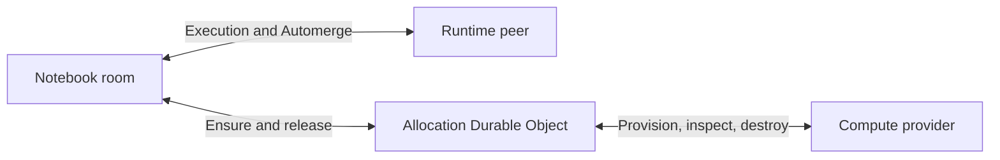

# Notebook compute allocations

Status: experimental implementation for celld-hosted sandboxed Python; broader provider design remains a proposal.

Clicking Play should be enough to request compute for a notebook. A connected workstation, an isolated Pyodide interpreter, and an Outerbounds workstation created on demand all need a launch owner that can finish or cancel provisioning even if the browser disconnects. This memo separates that resource lifetime from notebook execution.

## Ownership

The notebook room owns accepted execution intent, synced cell provenance, runtime-session selection, and validation of runtime-peer writes. The runtime peer executes accepted work and publishes outputs through the existing nteract protocol. Python code remains outside the room's trust boundary.

An allocation Durable Object owns one provider allocation: its request identity, provisioning operation, observed resource state, expiry policy, and cleanup obligation. It does not proxy Automerge, Python source, or outputs. Ordinary execution adds no allocation hop.

Allocate by a stable owner/notebook/session identity before starting provider work. Duplicate requests reuse that identity. A replacement has a new session ID. Persist desired state before provider side effects, reconcile uncertain responses, and fence terminal generations at the provider so close-before-open cannot resurrect compute. Execution IDs remain execution lineage; they are not infrastructure allocation IDs.

`WorkstationEvents` remains the notification channel. `OwnerComputeIndex` remains responsible for workstation presence leases and advisory session summaries. Existing attach jobs relate notebook intent to runtime sessions. Allocation state is not a second execution queue or a replacement notebook document.

## Initial implementation

`ComputeAllocation` is a private, optional namespace in notebook-cloud. The trusted room adapter sends `/ensure` and `/release` to the object for its authenticated owner/notebook/session. `/status` is private inspection; no browser-selected identity or public allocation endpoint is introduced. `/execute` continues directly to the existing Python provider.

The object persists `allocating`, `ready`, `releasing`, and terminal `released`/`failed` states. An alarm reconciles unfinished operations and retries uncertain cleanup. Re-entering an allocating object repeats the idempotent open; re-entering a ready object inspects the interpreter instead. If that interpreter was lost, the allocation fails and requires an explicit new runtime session. It never silently replaces a used Python namespace.

The Python provider retains deployment-wide and per-owner admission. Allocation objects do not independently grant quota. Provider close records a persistent release fence before cleanup and acknowledges after destruction, including an interpreter still initializing. Unconfirmed destruction retains capacity and cleanup is retried without blocking other sessions. A factory failure that cannot return a cleanup handle remains quarantined until the provider process is replaced; the allocation remains a cleanup obligation rather than claiming destruction. No used interpreter returns to the clean warm pool.

Transport and server errors during provisioning or inspection preserve the existing intent for a later alarm to reconcile. An inspection failure does not mean Python memory was lost: reattachment can use the last confirmed ready allocation, with inspection retried by its alarm. This is not a guarantee that the interpreter is currently reachable; execution still contacts that same provider session. A definite missing/releasing session or an explicit provider open rejection makes the allocation fail.

The room's existing 30-minute idle policy remains primary. Allocation housekeeping uses the provider's 35-minute orphan threshold, observes provider activity without joining the execution path, and does not expire busy interpreters. Alarm timing is not a real-time guarantee. Python variables and its virtual filesystem are transient; this does not implement memory snapshots or durable Python files.

This first slice intentionally leaves the existing attach UX and room startup choreography in place. Shared desktop/cloud progress rendering, browser-independent acceptance before cold startup, a public cancel/stop surface, and richer provider stages are follow-ups. The persisted allocation establishes a place for those features without claiming they already ship.

## Deployment and rollback

The namespace is enabled only alongside the celld Python provider. For a local export, set both `NOTEBOOK_CLOUD_CELLD_PYTHON=1` and `NOTEBOOK_CLOUD_CELLD_ALLOCATIONS=1`. The regular cloud deployment and desktop remain unchanged.

PR fleet configuration is generated by the trusted preview controller, not by application artifacts. The Python export includes `__compute-allocation.json` as a capability marker. A companion infrastructure change must validate it and explicitly enable `COMPUTE_ALLOCATIONS` / `ComputeAllocation` for the selected PR. The marker alone grants no deployment authority. Qualify that PR before changing fleet defaults.

Removing the binding restores the prior direct open/close path for new room instances. Code rollback does not erase allocation records or provider fences. Before disabling a tested preview, release its owned sessions or stop its isolated fleet; do not assume old allocation alarms will continue after their binding disappears. Existing notebook snapshots remain under the normal host retention policy.

Terminal allocation records and provider release fences are retained in this experiment. A bounded retention/compaction protocol is required before broad rollout: deleting fences without also rejecting old launch identities would reintroduce resurrection. Storage growth and one-minute reconciliation writes are explicit experimental costs.

## Other compute providers

For BYOC, release stops only the notebook runtime, never the user's workstation. An existing Outerbounds workstation can be reused or awakened with the same separation.

The intended on-demand Outerbounds mode gives an active notebook session an owned allocation from an approved, prebuilt environment image. Keep the image's explicit Python path and architecture. A supervised connector registers and launches the notebook runtime. Repeated cells and kernel restarts reuse the allocation; collaborators do not each create a workstation. Image building and workstation allocation remain distinct operations.

Notebook lifetime, compute lifetime, and file retention are separate. Owned workstation deletion must not discard files advertised as durable. Set a durable workspace and scratch policy before enabling automatic destructive cleanup. Only provider-created resources marked as owned may be deleted. Never implicitly replace a shared workstation's image to satisfy another notebook.

The integrated Outerbounds host currently uses ordinary-process actors. It needs equivalent durable allocation records and a recovery runner, or a deliberate celld deployment; adding a Durable Object binding here does not implement that host integration. Keep the lifecycle contract small rather than introducing a general orchestration framework. Experimental forks are design references, not product authority.

## Qualification

Exercise simultaneous ensure, identity mismatch, close-before-open, cancellation during startup, object reactivation, lost provider state, failed cleanup with alarm retry, busy/idle expiry, and direct execution routing. Then use a PR-backed preview to run real notebook cells, preserve variables across normal runs, recover after NameError, restart into a fresh namespace, and interrupt/release compute. Report source tests, actual celld recovery, preview health, and authenticated notebook execution separately.

Related: [Python runtime boundaries](python-runtime-boundaries.md), [remote workstation agents](../adr/remote-workstation-doc-agents.md), [compute session index](compute-session-index.md).
